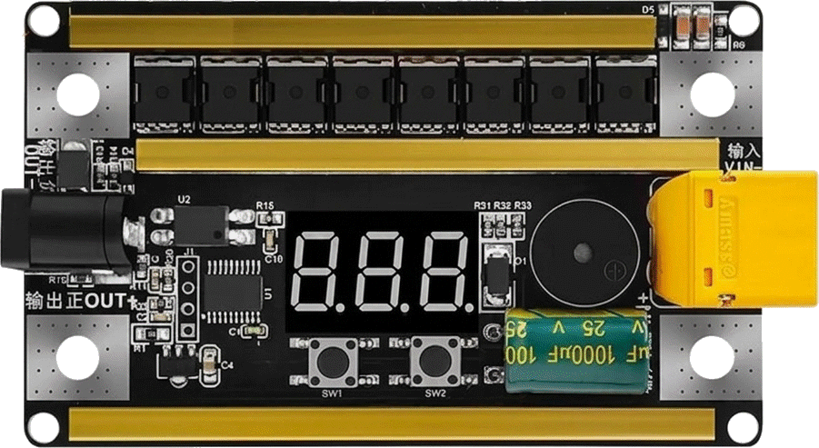

# Spot Welder Controller

A microcontroller-based spot welder controller with voltage monitoring, configurable pulse settings, and multiple trigger modes.



## Features

- **Real-time voltage monitoring** with 3-digit 7-segment display (0.1V resolution)
- **Adjustable pulse width** control (microsecond precision)
- **Multiple pulse count** settings (1-3 pulses)
- **Dual trigger modes**: Manual and Auto
- **Electrode contact detection** when pedal is disconnected
- **Low-power sleep mode** with wake-on-button/pedal
- **Audio feedback** via buzzer for user interaction
- **Optimized 8-sample moving average filter** for stable voltage readings

## Hardware Specifications

### Microcontroller
- **STC8H1K08** (8-bit 8051-based MCU)
- **Clock**: 16 MHz
- **ADC**: 10-bit resolution

### Pin Configuration

#### Port 1 - 7-Segment Display (Open-Drain)
```
P1.0 - Segment A
P1.1 - Segment B
P1.2 - Segment C
P1.3 - Segment D
P1.4 - Segment E
P1.5 - Segment F
P1.6 - Segment G
P1.7 - Decimal Point
```

#### Port 3 - Control & Input/Output
```
P3.0 - MOSFET Gate Control (open-drain)
P3.1 - Display Digit 1 Common Cathode (push-pull)
P3.2 - ADC Input - Voltage Measurement (high-impedance)
       └─ Voltage Divider: R1=200kΩ, R2=39kΩ
P3.3 - Display Digit 2 Common Cathode (push-pull)
P3.4 - Display Digit 3 Common Cathode (push-pull)
P3.5 - Buzzer Control (open-drain)
P3.6 - Button 1 (input with internal pull-up)
P3.7 - Button 2 (input with internal pull-up)
```

#### Port 5 - Trigger & Reference
```
P5.4 - Pedal Switch / Electrode Contact Detection (input, pull-up disabled)
P5.5 - +Vref (ADC Reference Voltage)
```

### Voltage Measurement
- **Divider Ratio**: (200kΩ + 39kΩ) / 39kΩ ≈ 6.13:1
- **ADC Reference**: 5.0V
- **Measurement Range**: 0-30V (with 0.1V resolution)
- **Filtering**: 8-sample moving average for noise reduction

## User Interface

### Button Functions

#### Button 1 (Pulse Width / Mode)
- **Short Press**: Decrease pulse width by 1 point (10μs steps)
- **Long Press**: Cycle through trigger modes
  - `A-0` - Manual trigger mode
  - `A-1` - Auto trigger mode (contact detection)

#### Button 2 (Pulse Count / Sleep)
- **Short Press**: Increase pulse width by 1 point (10μs steps)
- **Long Press**: Cycle through pulse count settings
  - `P-1` - Single pulse
  - `P-2` - Double pulse
  - `P-3` - Triple pulse
- **Very Long Press** (>3s): Enter sleep mode
  - Display turns off
  - All outputs disabled
  - Wake on button press or pedal activation

### Display Modes
- **Normal**: Shows input voltage (e.g., `12.3` = 12.3V)
- **Settings**: Shows mode/pulse settings (e.g., `A-0`, `P-1`)
- **Error**: Displays `Err` if voltage exceeds 999 (99.9V)

## Trigger Modes

### Manual Mode (A-0)
- Welding activated only by pressing the pedal/button
- Full user control over timing

### Auto Mode (A-1)
- **Without pedal**: Automatically triggers when electrodes make contact with workpiece
  - P5.4 detects short circuit between electrode and ground
- **With pedal**: Normal pedal operation
  - P5.4 detects pedal switch state

## Operation

1. **Power On**: Display shows input voltage
2. **Adjust Pulse Width**: Use Button 1/2 short press
3. **Set Pulse Count**: Button 2 long press to cycle P-1/P-2/P-3
4. **Select Trigger Mode**: Button 1 long press to toggle A-0/A-1
5. **Welding**:
   - Manual mode: Press pedal to activate
   - Auto mode: Touch electrodes to workpiece (or use pedal)
6. **Sleep**: Button 2 very long press to save power

## Building and Flashing

### Prerequisites
- [PlatformIO](https://platformio.org/)
- USB-to-Serial adapter for STC programming

### Build
```bash
platformio run -e STC8H1K08
```

### Upload
```bash
platformio run -e STC8H1K08 -t upload --upload-port COM5
```

## Technical Details

### Pulse Timing
- Microsecond-precision timing using calibrated `delay_us()` function
- Optimized for 8-bit MCU architecture with minimal overhead
- Actual timing verified and calibrated for 16MHz operation

### Display Multiplexing
- 3-digit refresh rate: ~200 Hz per digit
- Flicker-free operation with 5ms digit update interval

### ADC Filtering
- Ring buffer implementation for efficient memory usage
- Running sum algorithm: O(1) complexity
- Bit-shift division optimized for 8-bit MCU

## Safety Features

- **Voltage monitoring**: Continuous input voltage display
- **Error detection**: Overflow indication on display
- **Contact detection**: Prevents accidental firing in auto mode
- **Controlled pulse duration**: Precise timing prevents overheating
- **Sleep mode**: Reduces power consumption when idle

## License

MIT License

## Version
v1.0 - Initial release
